# CSAI Department Website

- ### The project aims to build a website for the CSAI Department of NSUT.
  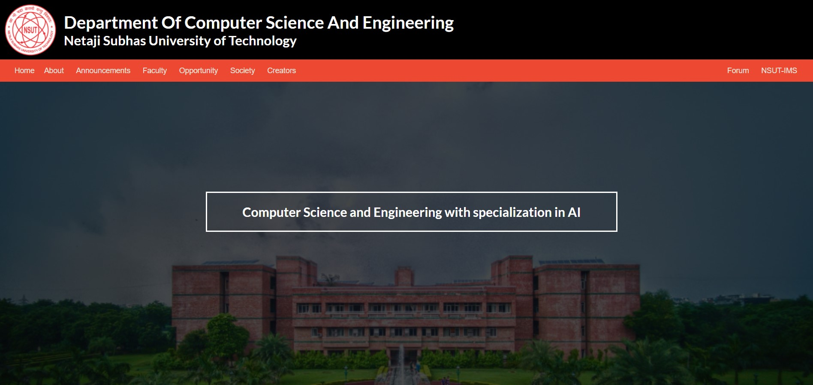

## Demo

https://csai-dept-forum.herokuapp.com

## Features

It caters to the basic needs of a student. It includes the following features:

1. About - Basic info about the CSE Department including the courses and specialisations offered.
2. Announcements - Regularly updated IMS notices relevant to the CSE Department.
3. Faculty - Includes info and contact details of various professors in the Department.
4. Opportunity - Displays important opportunities that are relevant to a student.
5. Society - A list of all technical and non-technical societies in the college.
6. Forum - An interactive forum to provide seamless interaction between students of all years thereby promoting a better environment on campus.

## This Project is made using MERN Stack:

1.  MongoDB
2.  Express
3.  React
4.  Node

## Pre-requisites to run the repo on localhost

1.  MongoDB
2.  Node

## To run the repository on the system:

1.  Clone the repository using "git clone https://github.com/tiwarishubham635/CSAI-Department-Website.git"
2.  Install node_modules via "npm install" in 2 folders repsectively.
    a. Base Folder
    b. client
3.  Come back to base folder and Use "npm start" to run the development server

## Snapshots of the Website

- ### Home Page

  

- ### About Page

  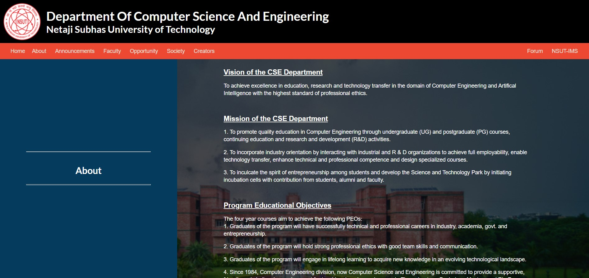

- ### Announcements Page

  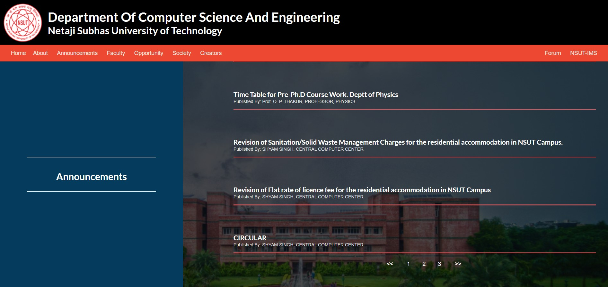

- ### Faculty Page
  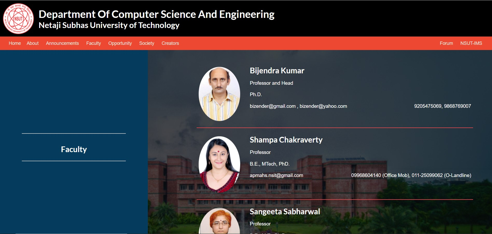
- ### Opportunities Page
  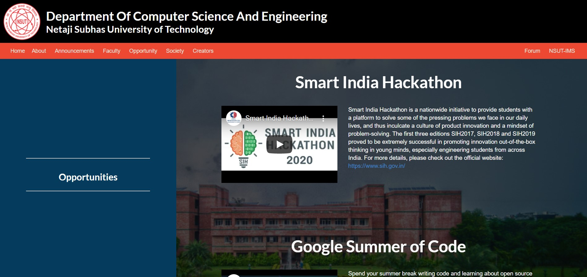
- ### Societies Page
  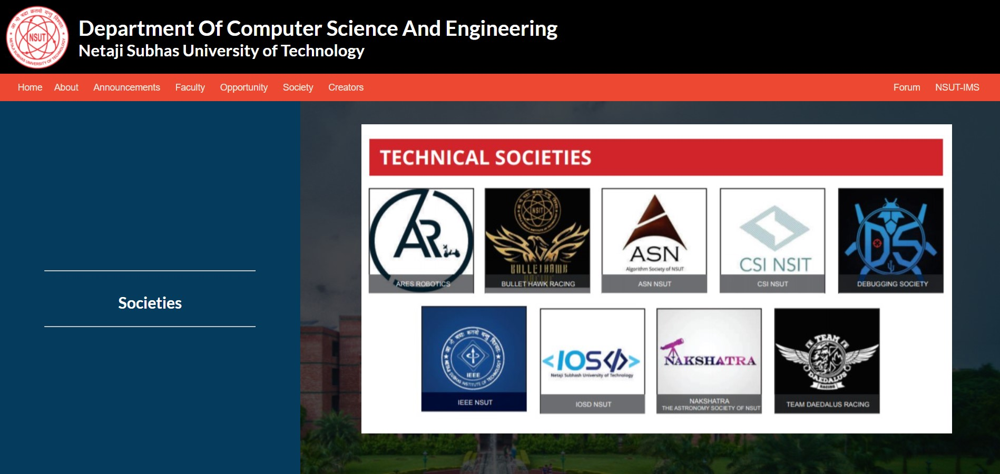
- ### Creators Page
  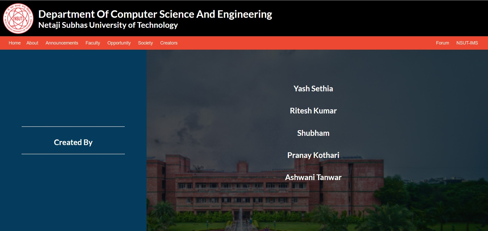
- ### Forum
  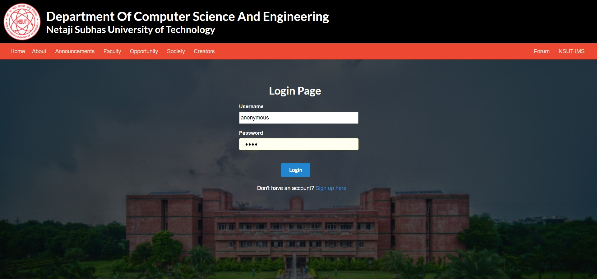
  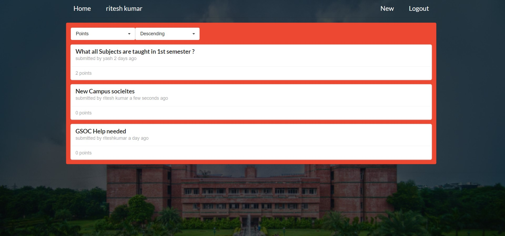
  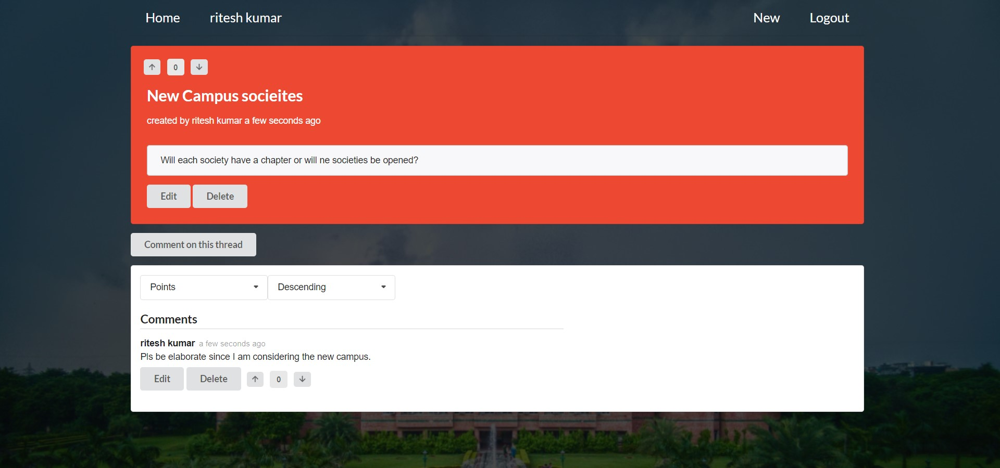
  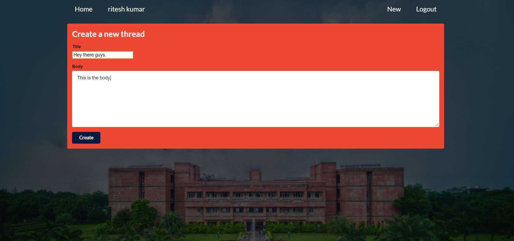
